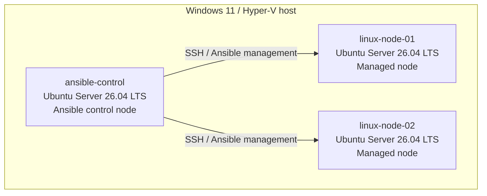
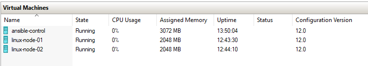
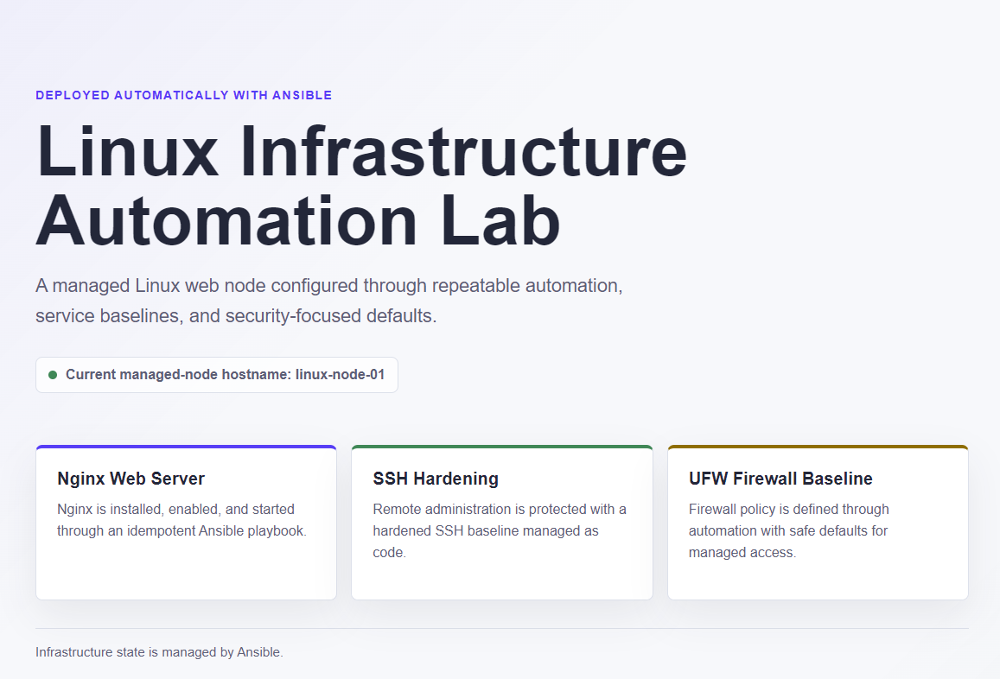

# Linux Ansible Infrastructure Lab

This project demonstrates a validated, three-node Linux infrastructure lab built on Windows 11 and Hyper-V, with Ansible automating provisioning, security hardening, web deployment, backups, maintenance, and public-safe operational evidence across two Ubuntu Server managed nodes. It is designed as a recruiter-facing example of practical Linux administration, repeatable automation, security-minded configuration, and evidence-based validation.

**[Live Case Study](https://farhanrahmananik.github.io/linux-ansible-infrastructure-lab/)** | **[GitHub Repository](https://github.com/farhanrahmananik/linux-ansible-infrastructure-lab)**

## Project Overview

The lab uses one Ubuntu Server 26.04 LTS Ansible control node to manage two Ubuntu Server 26.04 LTS nodes over SSH key-based access. The control node runs Ansible package `13.1.0+dfsg-1ubuntu1` and `ansible-core 2.20.1-1`. Eight focused playbooks cover account administration, package management, firewall policy, SSH hardening, Nginx deployment, backups, scheduled maintenance, and public-safe log collection.

The repository separates private connection data from public configuration. The real `inventory/hosts.ini` remains local and is ignored by Git, while `inventory/hosts.example.ini` provides a safe template for reproducing the lab.

## Architecture





## Automation Coverage

| Playbook | Purpose | Verified outcome |
|---|---|---|
| [`user_group_management.yml`](playbooks/user_group_management.yml) | Manages administrative groups and user accounts | Syntax and idempotency validated |
| [`package_management.yml`](playbooks/package_management.yml) | Refreshes package metadata and installs required packages | Syntax and idempotency validated |
| [`firewall_baseline.yml`](playbooks/firewall_baseline.yml) | Applies the UFW firewall baseline | Syntax and idempotency validated |
| [`ssh_hardening.yml`](playbooks/ssh_hardening.yml) | Applies and validates hardened SSH settings | Syntax and idempotency validated |
| [`nginx_deployment.yml`](playbooks/nginx_deployment.yml) | Installs, configures, enables, and starts Nginx | Syntax and idempotency validated |
| [`backup_automation.yml`](playbooks/backup_automation.yml) | Creates configuration backups and schedules recurring runs | Syntax and idempotency validated |
| [`maintenance_automation.yml`](playbooks/maintenance_automation.yml) | Configures routine package, log, and temporary-file maintenance | Syntax and idempotency validated |
| [`log_collection.yml`](playbooks/log_collection.yml) | Collects public-safe operational evidence | Syntax validated; log collection completed successfully |

All eight playbooks passed syntax validation. Repeat runs confirmed idempotency for user/group, package, firewall, SSH, Nginx, backup, and maintenance automation.

## Security Baseline

The validated baseline reduces unnecessary access while preserving required administration and web traffic:

- SSH key-based access is used for management.
- Effective SSH settings were confirmed as `PermitRootLogin no`, `PasswordAuthentication no`, and `PubkeyAuthentication yes`.
- UFW is active.
- OpenSSH and Nginx HTTP are the validated allowed services.
- The private inventory is ignored and excluded from the public repository.
- Evidence and documentation passed a public-safety review before publication.

## Repository Structure

```text
.
|-- ansible.cfg
|-- inventory/
|   `-- hosts.example.ini
|-- playbooks/
|   |-- backup_automation.yml
|   |-- firewall_baseline.yml
|   |-- log_collection.yml
|   |-- maintenance_automation.yml
|   |-- nginx_deployment.yml
|   |-- package_management.yml
|   |-- ssh_hardening.yml
|   `-- user_group_management.yml
|-- collected-logs/
|-- docs/                     # Case study and supporting documentation
|-- evidence/                 # Public-safe validation summaries
|-- screenshots/              # Scope validation screenshots
|-- .gitignore
`-- README.md
```

## Safe Local Setup

Clone the public repository and create a private inventory from the supplied template:

```bash
git clone https://github.com/farhanrahmananik/linux-ansible-infrastructure-lab.git
cd linux-ansible-infrastructure-lab
cp inventory/hosts.example.ini inventory/hosts.ini
```

Edit `inventory/hosts.ini` locally and replace only the template placeholders with values from your own lab. Do not commit that file. It is intentionally private and excluded by `.gitignore`; connection addresses, account names, credentials, and key locations must remain local.

From an Ansible control environment, verify the inventory and connectivity before running automation:

```bash
ansible-inventory --graph
ansible managed_nodes -m ping
ansible-playbook --syntax-check playbooks/user_group_management.yml
```

Use secure interactive authentication whenever privilege escalation requires it. Never place passwords or other secrets in the repository.

## Validation Highlights

| Area | Validated result |
|---|---|
| Connectivity | Both managed nodes passed Ansible ping |
| Playbooks | All eight passed syntax validation |
| Repeatability | Seven configuration playbooks passed idempotency validation |
| SSH | Root login and password authentication disabled; public-key authentication enabled |
| Firewall | UFW active with OpenSSH and Nginx HTTP allowed |
| Web service | Nginx active and enabled on both managed nodes |
| Backup | Generated archives passed gzip integrity and tar readability checks |
| Maintenance | Required maintenance timers validated |
| System health | Zero failed systemd units across all three nodes at validation time |
| Public safety | Evidence and documentation passed review; 14 public-safe screenshots retained |
| Scope status | Scope 9 and Scope 10 passed |
| Published case study | GitHub Pages returned HTTP 200 |
| Lighthouse | Desktop and mobile scored 100 in Performance, Accessibility, Best Practices, and SEO |

## Evidence and Documentation

The project records both technical outcomes and the checks used to support them:

- [Validation checklist](docs/validation-checklist.md)
- [Troubleshooting guide](docs/troubleshooting-guide.md)
- [Screenshot plan and captions](docs/screenshot-plan.md)
- [Scope 9 final validation summary](evidence/scope-9/final-validation-summary.txt)
- [Scope 10 local validation summary](evidence/scope-10/local-validation-summary.txt)



## Troubleshooting

The [troubleshooting guide](docs/troubleshooting-guide.md) documents real issues encountered during the build, including repository initialization, privilege-escalation authentication, deprecated command options, expected APT cache changes during idempotency checks, reviewed public-safety scan matches, and tasks intentionally skipped in check mode.

The central operating principle is to diagnose the observed state, apply the smallest safe correction, and rerun the relevant validation rather than treating expected changes or skips as failures.

## Key Lessons Learned

- Idempotency should be checked immediately after any expected cache refresh or operational change.
- Effective SSH configuration is more reliable evidence than configuration-file intent alone.
- Runtime checks complement syntax validation and play recap results.
- Backup automation is incomplete without archive integrity and readability checks.
- Scheduled operations require both configuration checks and timer-state validation.
- Public-safety scanning needs careful review so harmless patterns can be distinguished from sensitive infrastructure data.

## Portfolio Relevance

This project demonstrates the ability to design a small Linux environment, establish secure remote administration, translate operational requirements into repeatable Ansible playbooks, validate runtime and idempotent behavior, protect private connection data, and communicate results through concise documentation and a responsive case-study site. The repository emphasizes observable outcomes and reproducible checks rather than unsupported claims.
